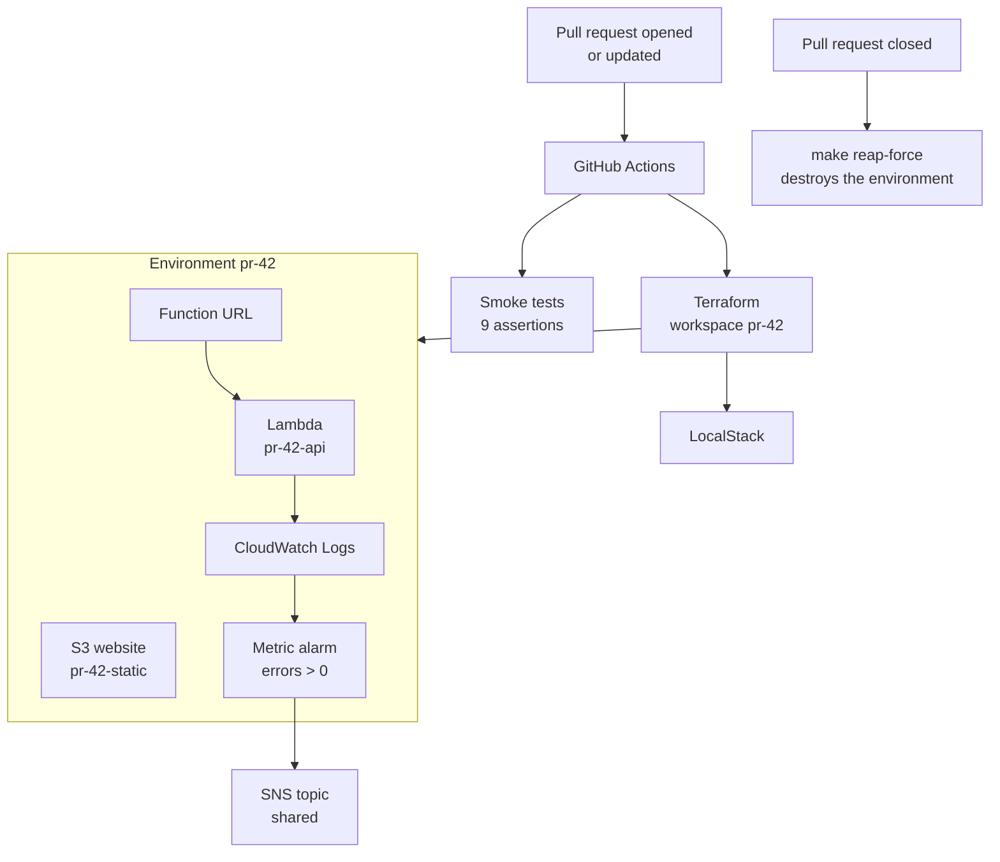

# Ephemeral Preview Environments

Every pull request gets its own isolated AWS environment, provisioned with Terraform from GitHub
Actions and destroyed when the pull request closes. Everything runs locally on
[LocalStack](https://localstack.cloud).

```
PR #42 opened  →  GitHub Actions  →  Terraform (workspace pr-42)  →  live environment
PR #42 closed  →  terraform destroy                              →  environment gone
```

Reusable Terraform modules, environment isolation through
workspaces, remote state with locking, infrastructure tests, a full lifecycle in CI, and governance
for environments nobody remembers to clean up.

---

## What it does

**One environment per pull request.** Each gets its own Lambda, HTTP endpoint, static site, log
group and alarm — 12 resources named `pr-<n>-*`, with state kept in a separate Terraform workspace.
Environments cannot interfere with each other.

**Built from the pull request's own branch.** `make env-up PR=42` asks GitHub which branch the pull
request points at, checks it out into a detached `git worktree` and builds from there. Your own
working tree is untouched, so environments for different branches can run side by side. The
environment remembers its ref, so later updates pull from the right place without arguments.

**The same commands locally and in CI.** The GitHub Actions workflow is a sequence of the same
`make` targets you run by hand — no separate CI scripts, no "works on my machine".

**Three kinds of environment from one module.** Preview environments are ephemeral and per-PR, `dev`
tracks `main`, `prod` deploys an explicit tag. They differ only in variables: log retention, Lambda
memory, and how deliberate a deployment has to be.

**Stale environments get reaped.** `make reap` checks every preview environment against the GitHub
API: an open pull request protects it, a closed or merged one marks it for destruction, and an
environment with no pull request at all is judged by how long it has been idle.

---

## Architecture



State is split so that nothing shared can be damaged by a single environment:

| Stack | Lifetime | State location |
|---|---|---|
| `bootstrap` | permanent | local file (it creates the remote backend itself) |
| `shared` | permanent | `shared/terraform.tfstate` |
| `envs/preview` | per pull request | `env:/pr-<n>/preview/terraform.tfstate` |
| `envs/dev`, `envs/prod` | permanent | `dev/`, `prod/terraform.tfstate` |

---

## Stack

| Layer | Technology |
|---|---|
| IaC | Terraform 1.9.8 — modules, workspaces, S3 backend, DynamoDB state lock |
| Cloud | LocalStack Community 4.14.0 |
| Compute | AWS Lambda (Python 3.12) behind a Lambda Function URL |
| Static hosting | S3 website hosting |
| Observability | CloudWatch Logs with retention, CloudWatch metric alarm, SNS |
| CI/CD | GitHub Actions |
| Tests | `terraform test`, Python `unittest`, HTTP smoke tests |
| Tooling | Make, Bash, `gh`, `git worktree` |

---

## Requirements

- Docker — LocalStack needs the Docker socket to run Lambda containers
- Terraform >= 1.9 — pinned to `1.9.8` in `.terraform-version`
- `aws-cli`, `jq`, `gh`, `python3`

If port 4566 is taken, copy `.env.example` to `.env` and set a free `LOCALSTACK_PORT`; both `make`
and `docker compose` read that file.

---

## Quickstart

```bash
make up            # start LocalStack
make bootstrap     # create the bucket and lock table holding Terraform state
make shared        # create resources shared by every environment

make env-up PR=42  # build the environment for pull request 42
make smoke PR=42   # verify it over HTTP
make env-down PR=42
```

`env-up` prints both URLs when it finishes:

```
api:  http://<id>.lambda-url.us-east-1.localhost.localstack.cloud:4566
site: http://pr-42-static.s3-website.localhost.localstack.cloud:4566
```

`localhost.localstack.cloud` is a public DNS record pointing at `127.0.0.1`, which is how LocalStack
supports host-based addressing locally.

---

## Commands

### Platform

| Command | Description |
|---|---|
| `make up` / `make down` | start / stop LocalStack |
| `make health` | print the LocalStack health payload |
| `make logs` | follow LocalStack's own logs |
| `make bootstrap` | create the Terraform state bucket and lock table |
| `make shared` | create the shared SNS topic |
| `make nuke` | stop LocalStack and delete all emulated state |

### Preview environments

| Command | Description |
|---|---|
| `make env-up PR=<n> [REF=<branch>]` | create or update an environment |
| `make env-down PR=<n>` | destroy it, including its worktree |
| `make env-url PR=<n>` | print its URLs |
| `make env-logs PR=<n>` | follow its application logs |
| `make env-list` | list live preview environments |
| `make reap` / `make reap-force` | show / destroy stale environments |

### Long-lived environments

| Command | Description |
|---|---|
| `make dev-up [REF=<branch>]` | deploy `dev`, tracking `main` by default |
| `make dev-down` | destroy `dev` |
| `make prod-plan [REF=<tag>]` | show what would change in `prod` |
| `make prod-apply REF=<tag>` | deploy a tag to `prod`, asking for confirmation |
| `make dev-url` / `make prod-url` | print their URLs |

### Quality

| Command | Description |
|---|---|
| `make test` | unit tests and Terraform tests |
| `make smoke PR=<n>` | HTTP smoke tests against a live environment |
| `make validate` | `terraform fmt -check` and `validate` across every configuration |
| `make fmt` | format Terraform files |

---

## Layout

```
app/
  api/handler.py            Lambda handler: GET /health, GET /info
  web/index.html.tftpl      static page rendered by templatefile()
terraform/
  bootstrap/                state bucket + DynamoDB lock (local state)
  shared/                   SNS topic for alarms
  modules/
    lambda-api/             IAM role, log group, Lambda, function URL
    static-site/            bucket, website config, public read policy, page
    monitoring/             metric alarm wired to SNS
    preview-env/            composition of the three above
  envs/
    preview/                per-PR root, one workspace per environment
    dev/  prod/             long-lived roots reusing the same module
scripts/
  env-up.sh                 resolve the ref, build a worktree, apply
  deploy.sh                 same for dev and prod
  worktree.sh               check a ref out into .worktrees/
  smoke.sh                  HTTP assertions
  reap.sh                   find and destroy stale environments
.github/workflows/
  validate.yml              unit tests, fmt, validate
  preview.yml               full lifecycle on every pull request
```

---
